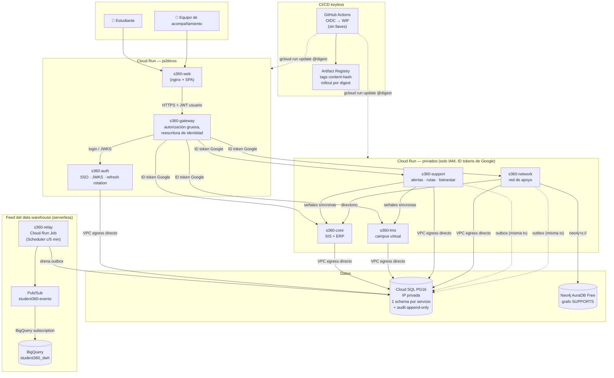

# Vista 360° del Estudiante — Documento de diseño y decisiones

**Prueba técnica · Semillero — Ingeniero de Arquitectura e Innovación**
Autor: Kevin Steven Nieto Curaca · Organización: [visionEAE](https://github.com/visionEAE)

---

## 1. Introducción

Este documento acompaña la solución construida para el caso *Vista 360° del Estudiante*: qué se
diseñó, por qué, cómo se comunican sus piezas, cómo se asegura, y las respuestas argumentadas a
las partes 1–4 de la prueba.

Metodología de trabajo:

- **Proceso creativo primero, diseño top-to-bottom después**: se definió una visión y una
  pregunta reto, se filtraron ideas por impacto/viabilidad, y solo entonces se diseñó de arriba
  hacia abajo — diagrama de arquitectura, contratos de API, diagrama de base de datos,
  implementación.
- **Versionamiento**: estrategia *trunk-based* durante la construcción inicial de cada
  repositorio (commits convencionales validados por hook local de lefthook — sin gastar minutos
  de CI en ello), evolucionando a un flujo de ramas cortas + PR + *rebase-merge* una vez cada
  repo tuvo su base funcional. Un PR = una funcionalidad lógica verificada.
- **Despliegue en GCP** con Terraform, arquitectura serverless (Cloud Run) y CI/CD *keyless*.
- **Servicios institucionales simulados** por motivos de alcance: SIS/ERP y LMS se simulan
  detrás de los mismos contratos que expondrían los sistemas reales, de modo que el reemplazo es
  configuración, no rediseño (supuesto declarado, ver §4).

## 2. Proceso creativo

### Visión

Lo primero que se definió fue una visión. Inicialmente estaba enfocada en *monitorear* el
desempeño de los estudiantes; sin embargo, monitorear no es el fin último — es un medio. El fin
se transmite así:

> Sería ideal poder **intervenir oportunamente** en los aspectos económicos, emocionales y
> académicos de todos los estudiantes de la Universidad Icesi.

### Pregunta reto

> ¿Cómo podemos crear un sistema de alertas tempranas que permita al equipo de acompañamiento
> intervenir oportunamente en los aspectos emocionales, académicos y económicos de los
> estudiantes de la Universidad Icesi?

### Información relevante (investigación)

- **Factor académico**: las calificaciones finales son indicadores *forenses* (llegan tarde).
  Los predictores tempranos más efectivos son conductuales: fluctuaciones de asistencia,
  entregas tardías repetitivas y descensos drásticos de actividad en el campus virtual.
- **Factor económico**: las tensiones financieras son la causa principal del abandono
  "silencioso". Los sistemas de retención cruzan contexto socioeconómico con eventos
  detonantes: retrasos en cuotas, apoyos denegados, riesgo de perder becas por condicionamiento
  de promedio.
- **Factor emocional**: difícil de rastrear pasivamente sin vulnerar la privacidad. Las
  instituciones pioneras usan herramientas activas — *encuestas de pulso* (micro-cuestionarios
  de estado de ánimo) — y proxies de aislamiento como la desconexión abrupta de redes de apoyo.
- **Tendencias**: *triage* institucional (derivar eficientemente, no solo predecir: los vacíos
  técnicos van a pares académicos, las alertas combinadas escalan a trabajo social); sistemas
  *opt-in* con transparencia (el estudiante sabe qué datos se cruzan y puede pedir ayuda
  proactivamente, eliminando el estigma de la intervención sorpresa); y mitigación de sesgos
  algorítmicos (no etiquetar "alto riesgo" por contexto demográfico de ingreso).

### Ideación

Lluvia de ideas puntuada de 0 a 5 bajo dos criterios: realizable en el tiempo disponible e
impacto alto en los estudiantes.

| Idea | Realizable en el tiempo | Impacto alto | Total |
|---|---|---|---|
| Modelo predictivo de intervención | 1 | 5 | 6 |
| **Ruta de intervención** | 5 | 5 | **10** |
| **Red de apoyo** | 3 | 4 | **7** |
| **Rincón seguro** | 5 | 4 | **9** |

**Resumen de la idea desarrollada**: una plataforma donde estudiantes y colaboradores registran
información sobre los aspectos económicos, académicos y emocionales, de tal manera que se
activen **rutas de intervención** según las necesidades detectadas, apoyándose en la **red de
apoyo** del joven dentro de la propia universidad — con el propósito futuro de aglomerar
información para entrenar un **modelo predictivo** de intervención temprana (por eso el data
warehouse es un requisito de primera clase, no un anexo).

Las tres ideas ganadoras existen en la solución: la ruta de intervención (alertas por regla de
convergencia + planes sugeridos), el rincón seguro ("Mi espacio seguro": encuesta de pulso en
tres dimensiones, *opt-in* y transparente) y la red de apoyo (grafo ponderado en Neo4j).

## 3. Arquitectura: función de cada repositorio

Un repositorio por unidad desplegable — cada servicio es un Cloud Run independiente, y esa es la
razón de la separación (escalamiento y ciclo de vida granulares, no monolito distribuido por
moda).

### Servicios de dominio

| Repositorio | Puerto | Función |
|---|---|---|
| [`student360-gateway`](https://github.com/visionEAE/student360-gateway) | 8080 | Punto de entrada único. Valida el token del usuario, aplica la autorización gruesa rol→ruta, **reescribe la identidad**: elimina el token del usuario y adjunta un token de servicio + la identidad validada como headers. Circuit breakers por ruta con degradación observable. |
| [`student360-auth-service`](https://github.com/visionEAE/student360-auth-service) | 8081 | SSO propio con el mismo contrato del IdP institucional (JWKS, claims de rol). Tokens de acceso RS256 de 15 min; *refresh tokens* opacos con rotación y **detección de reuso** (un replay revoca la familia de sesión completa). |
| [`student360-core-service`](https://github.com/visionEAE/student360-core-service) | 8082 | Simula SIS + ERP: identidad, estado académico (historial de promedio, materias y notas actuales), estado financiero (cuotas, mora, beca), directorio de profesores/estudiantes. Fuente de verdad de lo institucional. |
| [`student360-lms-service`](https://github.com/visionEAE/student360-lms-service) | 8083 | Simula el campus virtual: cursos, entregas, accesos, y la **señal interpretada** de engagement (días sin ingresar, tasa de entregas a tiempo, cursos inactivos). Separado del core porque produce señales conductuales de alta frecuencia, no estado oficial — y porque en la realidad es un tercero con su propio ciclo de vida. |
| [`student360-support-service`](https://github.com/visionEAE/student360-support-service) | 8084 | **Todo lo nuevo**: registros de bienestar (pseudonimizados por HMAC), la regla de riesgo convergente, alertas, planes de intervención, reportes y solicitudes del equipo de acompañamiento. Es el único servicio que llama a otros dos de forma síncrona y compone una decisión. |
| [`student360-network-service`](https://github.com/visionEAE/student360-network-service) | 8085 | La red de apoyo: grafo ponderado en **Neo4j** de quién apoya a cada estudiante. Cada arista `SUPPORTS` la califican (1–10) independientemente el estudiante y el equipo — ninguna opinión promedia a la otra. Grafo porque la pregunta es estructural y subjetiva, no una tabla de join. |
| [`student360-frontend`](https://github.com/visionEAE/student360-frontend) | 5173/8080 | SPA (React + Vite, atomic design) servida por nginx en Cloud Run. Dos experiencias: la vista 360° del estudiante y el panel del equipo de acompañamiento. |
| [`student360-dwh-relay`](https://github.com/visionEAE/student360-dwh-relay) | job | Alimenta el data warehouse: drena las tablas *outbox* hacia Pub/Sub (ver §5). |

### Fundaciones e infraestructura

| Repositorio | Función |
|---|---|
| [`student360-common`](https://github.com/visionEAE/student360-common) | Biblioteca compartida: auditoría (aspecto `@Audited` + escritor JDBC), identidad y correlación, puertos de tokens de servicio con **dos pares de adaptadores** (HS256 local / ID tokens de Google), publicador outbox, logging JSON. Los puertos son el mecanismo que hizo del paso a la nube un cambio de adaptadores y no un rediseño. |
| [`student360-infra`](https://github.com/visionEAE/student360-infra) | Orquestación local (docker-compose: Postgres + Neo4j + Adminer), Makefile, seeds, scripts de demostración con casos negativos, y toda la documentación transversal (`docs/`). |
| [`terraform-backend`](https://github.com/visionEAE/terraform-backend) | La mitad **irrecuperable** de la infra GCP: bucket de estado de Terraform, Artifact Registry (historial de rollback), Secret Manager, la identidad keyless de CI (WIF) y el dataset de BigQuery. Regla de separación: *si esto se destruyera, ¿reconstruirlo sería solo lento, o se perdería algo?* |
| [`terraform-core`](https://github.com/visionEAE/terraform-core) | La mitad **desechable**: los 7 servicios Cloud Run + el job relay, Cloud SQL (IP privada), networking, el feed del DWH y el bastión. Destruible y reconstruible desde cero contra los outputs del backend. |
| [`workflows`](https://github.com/visionEAE/workflows) | CI/CD genérico reutilizable: verificación, build con *gate por hash de contenido* y despliegue por *digest* (§5.3). Cada repo solo lleva dos *callers* delgados. |

### Diagrama de arquitectura (GCP)

## 4. Supuestos declarados

1. **SIS, ERP y LMS se simulan** exponiendo el contrato que los sistemas reales expondrían a
   través de la plataforma de integración institucional (que no se construye: es una caja en el
   diagrama — traducción de protocolos, throttling, frontera de diagnóstico).
2. **El SSO es propio pero con el contrato del IdP institucional** (JWKS, claims): reemplazarlo
   es una propiedad del gateway, no un cambio de código.
3. **Una instancia PostgreSQL, un schema por servicio, un rol confinado por schema** —
   verificable (`make check-isolation` prueba las operaciones prohibidas y afirma que fallan).
4. **GCP no tiene grafo gestionado**: Neo4j corre en AuraDB Free (externo, `neo4j+s://`), y esa
   es la única diferencia con el Neo4j local.
5. **Los eventos de dominio se persisten primero** (patrón outbox, en la transacción del
   negocio) y se publican después: el sistema funciona completo sin el warehouse, y el warehouse
   nunca pierde lo ocurrido mientras estuvo desconectado.

## 5. Comunicación y orquestación de servicios

### 5.1 El camino de una petición (síncrono)

La SPA habla **solo con el gateway**. En cada llamada: el gateway valida el JWT del usuario
contra el JWKS del SSO, aplica la regla gruesa (¿puede este *rol* llegar a esta familia de
rutas?), y reenvía **reescribiendo la identidad** — el token del usuario nunca viaja más allá:
el servicio destino recibe un token de servicio (audiencia = ese servicio) más la identidad
validada como headers (`X-User-Id`, `X-User-Roles`, `X-External-Reference`) y el `X-Request-Id`
que correlaciona todo el recorrido.

Solo **support-service compone**: registrar un pulso de bienestar dispara síncronamente la
lectura del estado financiero (core) y la señal de engagement (lms), evalúa la regla de riesgo
sobre las tres dimensiones y genera la alerta con su ruta de intervención sugerida. Todos los
demás responden desde su propio almacén. Las fuentes caídas **degradan por sección** (circuit
breaker + fallback observable), nunca tumban la vista completa.

En la nube no hay ciclos de configuración: las URL de Cloud Run son determinísticas
(`https://<servicio>-<nº proyecto>.<región>.run.app`) y se calculan en Terraform, así que el
gateway recibe sus cinco URLs — y cada servicio su propia audiencia — **al crearse**.

### 5.2 Eventos y data warehouse (asíncrono)

Cada cambio de estado relevante escribe su evento en la tabla `outbox_event` del propio schema,
**en la misma transacción del negocio** — o se confirman juntos o se revierten juntos. El job
`s360-relay` (Cloud Scheduler, cada 5 min) drena las tablas con `FOR UPDATE SKIP LOCKED`
(ejecuciones solapadas se saltan mutuamente en vez de bloquear o duplicar), publica el envelope
textual a Pub/Sub y marca `published_at` solo tras el *ack* del broker. Entrega *at-least-once*;
deduplicación en BigQuery por el `eventId` del envelope. La *BigQuery subscription* aterriza
cada mensaje en `student360_dwh.outbox_events` sin una línea de código consumidor.

### 5.3 Orquestación de despliegues

Los pipelines (repo `workflows`) hacen dos cosas distintas con dos identificadores distintos:

- **Hash de contenido como gate de build**: el tag de la imagen se deriva de lo que realmente
  entra en ella (fuentes, pom/lockfile, Dockerfile, el commit exacto de `student360-common` — y
  para la SPA, la URL del gateway, que Vite hornea en el bundle). Si ese tag ya existe en el
  registry, no se construye nada: se reutiliza el digest.
- **Digest como unidad de rollout**: un tag se puede mover; un digest no. Toda revisión nombra
  exactamente los bytes que ejecuta y el rollback es un comando con un digest leído del resumen
  de un run anterior.

Terraform es dueño de la *forma* de cada servicio; el pipeline es dueño de *qué build está vivo*
(`ignore_changes` sobre la imagen). El trigger manual está siempre disponible.

## 6. Seguridad clave

**Autenticación de personas.** SSO con tokens de acceso RS256 de 15 minutos (claims: `roles`,
`ref`, `sid`, `jti`) y refresh tokens opacos (hash SHA-256 en base) con **rotación y detección
de reuso**: presentar un refresh ya consumido revoca la familia de sesión completa y queda
auditado como evento de seguridad. Rate-limit de login.

**Autorización en dos capas, a propósito.** El gateway responde la pregunta gruesa (¿puede un
`STUDENT` llegar a `/api/support/advisors/**`? → no). La pregunta fina — ¿puede *este*
acompañante ver a *ese* estudiante? — se decide **dentro del servicio dueño del dato**, que es
también donde se audita, registrando la *base* de la decisión: `SELF`, `ASSIGNMENT`,
`STAFF_ROLE`, `ADMIN_ROLE` o `NONE`. Un estudiante solo se ve a sí mismo; un acompañante solo a
sus asignados vigentes (la asignación se verifica contra datos, no contra el rol).

**Servicios entre sí.** Detrás de dos puertos (`ServiceTokenProvider`/`Validator`) hay dos pares
de adaptadores seleccionados por configuración: en local, HS256 con secreto compartido; en
producción, **ID tokens firmados por Google** — los servicios internos son privados por IAM
(solo las service accounts listadas como invokers pueden llamarlos), Cloud Run valida el token
en la plataforma y la aplicación lo vuelve a validar (defensa en profundidad) extrayendo la
identidad del llamador. El secreto compartido **no existe** en producción.

**CI/CD keyless.** Ninguna llave de service account existe en ningún lugar: GitHub Actions
intercambia su token OIDC por credenciales efímeras vía Workload Identity Federation, con una
condición que fija **dueño + allowlist explícita de repositorios** (cualquier repo creable en la
organización no debe heredar derechos de despliegue). El deployer es *writer* del registry —
nunca admin: ningún pipeline puede borrar el historial de rollback — y `run.developer` por
servicio — nunca `run.admin`: ningún pipeline puede reescribir el IAM de un servicio.

**Secretos y datos sensibles.** Todo secreto vive en Secret Manager (contraseñas de BD
generadas por Terraform y rotables fuera de él; llave JWT montada como volumen; credenciales de
AuraDB suministradas fuera del estado). Los registros de bienestar se **pseudonimizan** con HMAC
antes de persistir — el id del estudiante nunca acompaña al contenido sensible.

**Auditoría append-only.** Tabla `audit.audit_record` en un schema que **ningún servicio posee**;
los grants permiten solo `INSERT` y `SELECT` — el motor, no el código, garantiza que nadie
(incluido quien escribió el registro) puede alterarla. Cada registro lleva actor, acción,
sujeto, resultado, base de autorización, `request_id` y `trace_id`.

## 7. Respuestas a las preguntas de la prueba

### Parte 1 — Diseño: de dónde sale cada dato y por qué

| Dato | Fuente | Por qué así |
|---|---|---|
| Información personal, académica y financiera | `core-service` (SIS+ERP simulados) | Es estado *oficial*: una sola fuente de verdad institucional, consultada en vivo — copiarla crearía el problema de sincronización que la prueba no pide resolver |
| Actividad en el campus virtual | `lms-service` | Señal conductual de alta frecuencia, *interpretada* (días sin ingresar, % a tiempo) — separada del estado oficial porque su naturaleza, volumen y dueño real son otros |
| Reportes, alertas, solicitudes, bienestar | `support-service` (schema propio) | **Son registros nuevos que no existen en ningún sistema**: nacen aquí, con su propia base de datos, su regla de riesgo y su auditoría |
| Red de apoyo (quién apoya a quién, con qué fuerza) | `network-service` (Neo4j) + directorio de `core` | Relación subjetiva, mutable y estructural → grafo; los datos de contacto institucionales se resuelven del directorio **en tiempo de lectura** (nunca se copian: no pueden quedar obsoletos) |
| Data warehouse | outbox → relay → Pub/Sub → BigQuery | El evento se persiste con el negocio (transaccional) y se publica después: el DWH puede caerse sin perder nada y sin frenar la operación |

La comunicación entre componentes es el §5; el diagrama, el §3.

### Parte 2 — Servicio: materias matriculadas y notas actuales

Implementado en `student360-core-service` como parte del contrato v2:

**Contrato** — `GET /api/core/students/{id}/academic-status` (a través del gateway, con el token
del usuario). Devuelve, entre otros: `currentTerm`, `academicStanding`, `cumulativeGpa`,
`gpaHistory[]` y **`currentCourses[]`** — `{code, name, credits, currentGrade}` por cada materia
inscrita en el período actual. `404` si el estudiante no existe (solo para staff — un estudiante
no autorizado recibe `403` *antes* de la comprobación de existencia, para no filtrar existencia).

**Base de datos** (schema `core`, migrada por Flyway, versiones inmutables):
`student` (id externo `S-1001` como llave cross-service, código institucional, programa),
`program`, `enrollment` (término, créditos, promedio del término y acumulado, *standing*),
`course_grade` (estudiante, término, materia, créditos, nota acumulada actual),
`professor` y `course_offering` (quién dicta qué, por término).

**Implementación**: Java 21 / Spring Boot, CQRS (`FindAcademicStatusQuery` → handler → modelo de
lectura con la forma exacta del contrato), autorización fina antes de la existencia, acceso
auditado con base `SELF`/`STAFF_ROLE`. Verificado por tests de integración con Testcontainers
(estudiante ve lo suyo; el ajeno → 403 auditado como DENIED; staff ve todo).

### Parte 3.1 — Seguridad

Respondida en profundidad en el §6. En síntesis: SSO con rotación y detección de reuso;
autorización en **dos capas** (gruesa en el gateway por rol→ruta; fina en el servicio dueño del
dato, verificando `SELF` o asignación vigente, auditada con su base); el token del usuario nunca
pasa del gateway; servicio-a-servicio con ID tokens de Google sobre servicios privados por IAM
(HS256 solo en local, detrás de los mismos puertos); y CI keyless por WIF.

### Parte 3.2 — Comunicación

**Escenario A (estado financiero inmediato): síncrono, en vivo, con degradación.** La consulta
va SPA → gateway → `core-service`, que responde desde la fuente de verdad. Se resolvió síncrono
porque el usuario está esperando y el dato debe ser el *actual* (una copia local introduce el
problema de "¿qué tan fresco?" sin necesidad). El costo del síncrono se paga con: circuit
breaker por ruta (solo transporte y 5xx lo abren — un 4xx es una respuesta, no una falla),
timeout corto, y **degradación por sección**: si el ERP no responde, la tarjeta financiera
muestra "no disponible" con su request id, y el resto de la vista carga.

**Escenario B (cambia la condición académica → procesos + DWH): evento persistido primero.**
El cambio escribe su evento en el outbox **dentro de la misma transacción** del cambio — jamás
puede existir el cambio sin su evento ni el evento sin su cambio. De ahí, dos caminos:
(1) la reacción *temprana* de la plataforma es la regla de riesgo de `support-service`, que
evalúa las señales convergentes y levanta la alerta con ruta de intervención;
(2) hacia otros procesos y el warehouse, el relay publica el envelope a Pub/Sub — cualquier
proceso futuro se suscribe al topic sin tocar a los productores, y la BigQuery subscription
alimenta el DWH sin código. Se eligió *outbox + broker* sobre llamadas directas porque
desacopla la disponibilidad (el productor nunca espera al consumidor), garantiza no perder
eventos y deja el envelope exacto listo para *n* consumidores.

### Parte 4 — Operación y calidad

**Escenario A (información académica que a veces no carga).** Cómo lo afrontaría con lo que la
solución ya tiene previsto: (1) pedir a un director el **request id** que la UI muestra junto a
cada sección degradada; (2) con él, reconstruir el recorrido completo — el id se propaga del SPA
al último servicio y aparece en los logs JSON (Cloud Logging) y en la traza W3C de cada salto;
(3) mirar el estado del **circuit breaker** de la ruta core (`/actuator/health` lo expone): un
breaker abriéndose intermitentemente delata timeouts o 5xx del origen; (4) correlacionar con la
tabla de auditoría (`SELECT … WHERE request_id = …`), que dice qué servicio respondió y cuál
no llegó a escribir. Lo *previsto desde el diseño* que lo hace posible: request id end-to-end,
logs estructurados, trazas, breakers con salud observable, degradación por sección (el síntoma
"no carga a veces" es exactamente el fallback haciéndose visible en vez de un error opaco), y
tests de resiliencia que ya ensayan la fuente caída.

**Escenario B (reclamo: "alguien consultó o alteró mi información").** La respuesta certera
sale de la **auditoría append-only**: cada acceso a datos de un estudiante quedó registrado con
actor, acción, sujeto, resultado (`ALLOWED`/`DENIED`) y **base de autorización** — de modo que
la institución puede responder no solo *quién accedió*, sino *con qué derecho* (era el propio
estudiante; era su acompañante asignado; o fue denegado). Que el registro sea inalterable no es
política sino motor: el schema `audit` no lo posee ningún servicio y los grants no incluyen
`UPDATE`/`DELETE` — ni siquiera quien escribió el registro puede tocarlo, lo que le da valor
probatorio frente al reclamo. La consulta es directa:
`SELECT * FROM audit.audit_record WHERE subject_id = 'S-…' ORDER BY occurred_at`. Y "alterado"
tiene doble verificación: los cambios de estado son eventos auditados (`STATE_CHANGE`) y además
quedaron en el outbox con su envelope completo.

## 8. Declaración de uso de IA

Se usó **Claude Code** (Anthropic) como herramienta de desarrollo asistido durante toda la
construcción: exploración y diseño de la arquitectura, implementación de los servicios y de la
infraestructura como código, escritura y ejecución de tests, verificación en navegador real de
los flujos, redacción de documentación, y operación del despliegue en GCP. Las decisiones de
producto y arquitectura (visión, ideación, selección de ideas, separación de repositorios,
elección de grafo para la red de apoyo, estrategia de despliegue) fueron dirigidas por el autor;
la herramienta ejecutó, propuso alternativas con trade-offs y verificó cada cambio con tests
antes de integrarlo.

## 9. Entregables

| Parte | Dónde |
|---|---|
| 1 · Diagrama + decisiones | Este documento (§3 diagrama, §4–5 decisiones y supuestos) |
| 2 · Servicio + README | [`student360-core-service`](https://github.com/visionEAE/student360-core-service) (contrato en [`api-contract-v2.md`](api-contract-v2.md)) |
| 3 y 4 · Escenarios | §7 de este documento |
| Ejecución local | [`running-locally.md`](running-locally.md) — credenciales demo incluidas |
| Despliegue GCP | [`stage2-deployment.md`](stage2-deployment.md) |
| Visión pública del sistema | [OVERVIEW de la organización](https://github.com/visionEAE/.github/blob/main/docs/OVERVIEW.md) |
